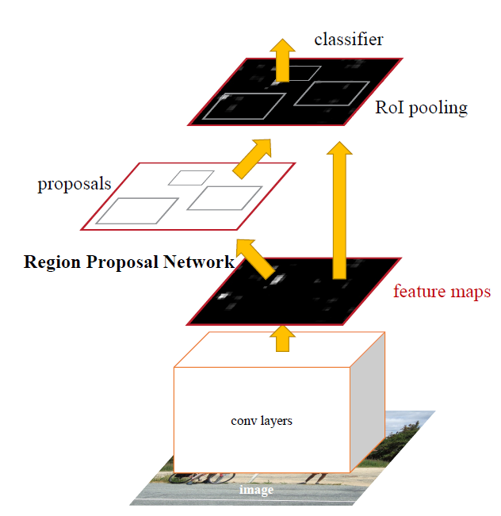
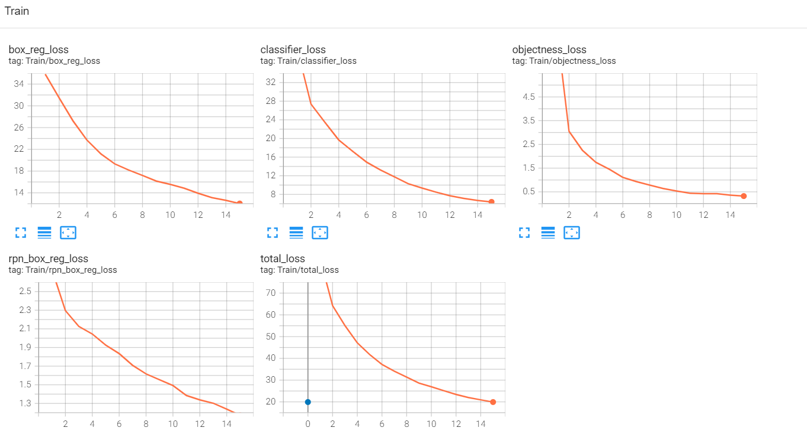

# Training code for torchvision FasterRCNN model with custom COCO dataset

---
# Faster RCNN :
Faster RCNN is an object detection model introduced in [Faster R-CNN: Towards Real-Time Object Detection with Region Proposal Networks](https://arxiv.org/abs/1506.01497) paper.

The architechure of Faster RCNN model is shown below,

Faster R-CNN, is composed of two modules. The first module is a deep fully convolutional network that proposes regions, and the second module is the Fast R-CNN detector that uses the proposed regions.

---
# Environment :
- Python version used : 3.9.16
- Create a python or conda environment using ***requirements.txt***

---
# Training Instructions :

To train the Faster RCNN model follow the below steps :

1. Prepare dataset :
    - Prepare dataset in COCO format. It should have the below 2 files & folders
        - Image folder 
        - Annotation file (Json file) in coco format

2. Run :
    > python train.py --epoch 10 --train_image_dir <train_image_folder> --val_image_dir <val_image_folder> --train_coco_json <train_coco_json> --val_coco_json <val_coco_json> --batch_size 16 --exp_folder <experiment_folder>

    The training weights and tensorboard logs will be saved in experiment folder

    The training and validation logs can be visualized in tensorboard as shown below :
    > Train logs
        
    > Val Logs
        

---
# Inference :

The instruction about inference with a trained model are discussed in ***demo_inference.ipynb*** notebook